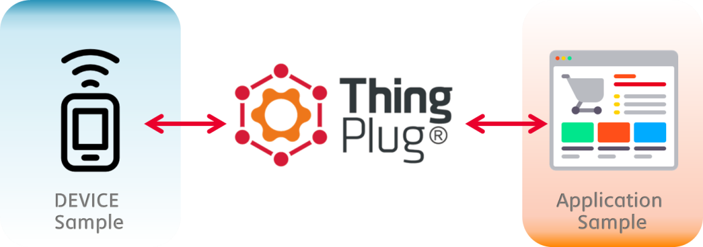
# SKT ThingPlug oneM2M Starter Kit

Starter Kit 은 SKT의 ThingPlug에서 제공하는 IoT 국제 표준 oneM2M API를 이용하여 LoRa서비스 개발 환경을 구축할 때 좀 더 쉽게 접근하고, 서비스의 다양한 시나리오를 빠르게 테스트 할 수 있도록 제공하는 Device와 Application 시뮬레이터입니다. 본 Starter Kit을 통하여 SK Telecom의 ThingPlug 를 활용하는 방법을 쉽게 이해하고, 다양한 서비스 개발을 Starter Kit에서부터 시작해보세요

### ThingPlug StarterKit의 주요 특징 및 기능

-   실제 Device가 없어도 서비스 테스트가 가능하도록 제공하는 모듈입니다.

-   ThingPlug가 제공하는 IoT 국제 표준인 oneM2M규격 REST API를 활용하여 범용성을 확보하였습니다.

-   node.js와 express 웹 애플리케이션 프레임워크 등으로 구성되어 쉽게 개발하고 수정할 수 있습니다.

-   IFTTT 및 지도, 그래프 등 다양한 컴포넌트 탑재로 데이터와 서비스간 인터페이스 예제를 제공합니다.

-   Github에 예제가 업로드 되어있어 바로 다운로드 가능합니다.

### ThingPlug API 주요 구성

Starter Kit에서는 역할에 따라 구성원을 다음 네 가지로 구분할 수 있습니다.

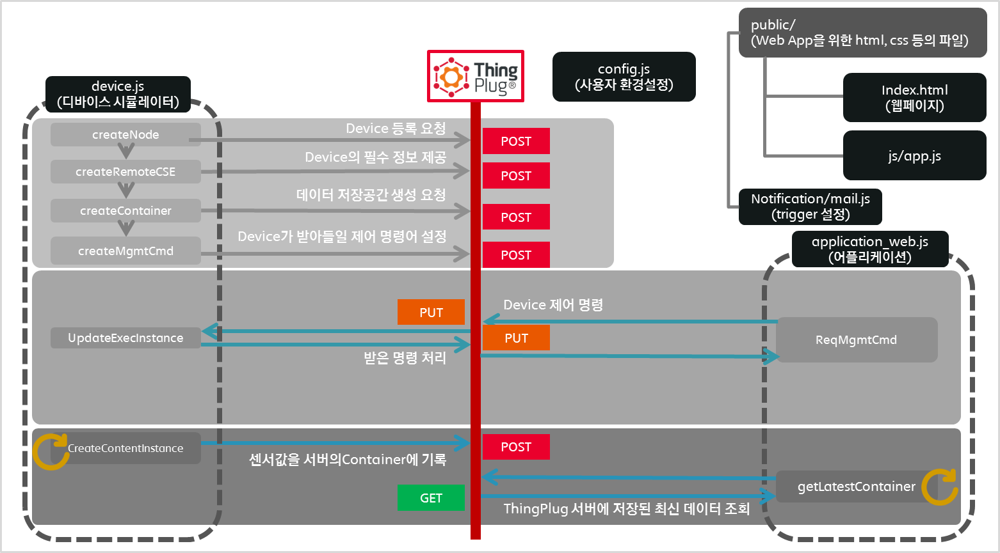

-   애플리케이션 클라이언트 (Application)
-   디바이스 클라이언트 (Device)
-   oneM2M API를 제공하는 ThingPlug 서버 (ThingPlug)

애플리케이션과 디바이스는 직접적으로 통신하지 않고 각 구성원들은 기본적으로 ThingPlug가 제공하는 oneM2M 표준 기반의 REST API를 통해 oneM2M 서버와 통신을 하게 됩니다. 해당 API를 통해 제공되는 IoT의 공통적인 기능(예, 데이터 저장, 장치 관리, 장치 등록 등)은 디바이스와 애플리케이션의 개발자들이 좀 더 쉽게 서비스를 개발할 수 있는 환경을 제공합니다.


<span id="starter-kit-실행절차-요약" class="anchor"><span id="_Toc459022496" class="anchor"></span></span>Starter Kit 실행절차
------------------------------------------------------------------------------------------------------------------------------

다음 절차를 따르면 간편하게 Starter Kit을 실행할 수 있습니다.

1.  사전 준비 : 필요한 필수 도구 설치 및 코드 복사

2.  Code 복사

3.  프로젝트 dependency를 설치

4.  나의 ThingPlug 계정정보에 맞게 일부 파일(config.js)을 수정

5.  Device.js를 실행

6.  ThingPlug에 내 계정에 Device를 등록

7.  Application\_web.js 실행

### <span id="사전-준비" class="anchor"><span id="_Toc459022497" class="anchor"></span></span>사전 준비

#### Node 설치

Starter Kit을 실행하기 위해서는 다음과 같은 도구가 설치되어 있어야 합니다.

-   [Node.js](https://nodejs.org) : 공식 사이트에서 설치 패키지를 다운받을 수 있습니다.

> 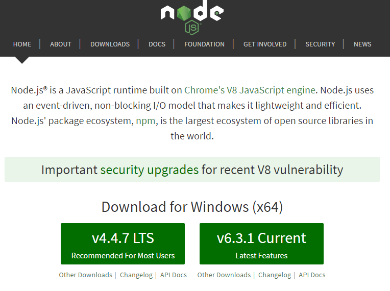
>
> 그림 3 – node.js 설치

#### 코드 복사

Git에 Release된 프로젝트 압축파일을 다운 받아서 임의에 폴더에 압축을 해제하세요. 또는 아래 명령어를 이용하여 github의 master 버전을 clone해도 됩니다.

```
git clone https://github.com/SKT-ThingPlug/thingplug-starter-kit.git
```

복사된 폴더 안을 살펴보면 다음과 같은 주요파일이 있습니다.

>

-   `config_x.js` : 개발자 인증키와 디바이스 ID등 스타터킷 실행에 앞서 필요한 환경 값을 가지고 있습니다. 각자의 상황에 맞게 수정이 필요합니다.

-   `device_mqtt_x.js` : 실제 IoT Device에서 구동이 가능한 코드 입니다. Node.js로 구현되어 있어 Node.js가 실행 가능한 컴퓨터에서 실행가능하며 [BeegleBone Black](http://beagleboard.org/black) 같이 Node.js를 구동할 수 있는 IoT Device에서 직접 실행이 가능합니다. 해당 js파일은 mqtt방식의 프로토콜을 적용한 버전입니다.

-   `device_http_x.js` : 해당 파일은 device.js파일의 http 버전입니다.

-   `application_web.js` : Express.js를 사용한 Web API 서버로 Sample Web Application에서 호출하는 backend 서버의 역할을 합니다. `device.js`에서 ThingPlug로 전송한 데이터를 사용자에게 보여주거나 웹페이지로부터 명령을 받아 ThingPlug 서버를 통해 실제 device를 제어하기도 합니다.

-   `public/` : Sample Web Application의 html, css, javascript 등 정적 파일 목록입니다.

-   `notification/` : trigger 발생시 문제를 notify하기 위한 E-MAIL관련 파일이 있습니다. 현재 E-MAIL은 <a href="https://nodemailer.com/">nodemailer</a> api를 활용해 전송을 하는 방식을 활용하였으며, GMAIL계정정보를 mail.js에 입력하시면 됩니다. 이외에도 개발자가 nodejs의 library를 통해 다양한 방법을 응용할 수 있습니다.

> 현재 sample의 경우 multi Device를 지원하기위해 ***{js파일 이름_숫자}*** 형태로 mapping 하였습니다.
>
> Device의 숫자를 변경하기 위해서는 몇가지 변경사항이 있습니다.

1.  `config_x.js`와 `device_x.js`파일을 추가 또는 삭제 (번호는 1번부터 빠짐없이 순차로)
2.  `config_x.js`의 `nodeID`수정
3.  `application_web.js`의 `numOfDevice`수정
4.  `/public/js/app.js` 의 `numOfDevice` 수정

#### 프로젝트 dependency 설치

Starter Kit을 통해서 실행하는 device와 application은 Node.js로 구현되어 있으며 실행에 필요한 dependency 정보는 package.json에 기입되어 있습니다. 따라서 위에서 복사한 starter kit 폴더(package.json이 존재하는 폴더)로 이동 후 `npm install` 명령어를 통해 dependency 설치하세요.

<span id="config.js-수정" class="anchor"></span>

### config.js 수정

Starter Kit이 실질적으로 동작하기 위해서는 개발자 계정정보 및 디바이스 정보를 개발자 상황에 맞게 수정해야합니다. `config.js_sample`파일을 `config.js`파일로 복사한 후 `config.js`를 에디터에서 열고 각 항목 오른쪽에 달린 주석 설명과 아래 설명을 참고하여 수정하세요.

```javascript
module.exports = {

  AppEUI : 'starterkittest',                   		// Application EUI
  DevEUI : 'DevEUI',								// Device EUI
  version : 'v1_0',                             	// Application의 version
  TPhost : 'thingplugtest.sktiot.com',      		// ThingPlug의 HOST Addresss
  TPport : '9000',                             		// ThingPlug의 HTTP PORT 번호

  responseAddress : 'http://0.0.0.0',         		// HTTP버전에서 디바이스 제어를 위한 디바이스의 물리적 주소 mga
  responsePORT : '0000',                        	// HTTP버전에서 디바이스제어를 위한 디바이스의 물리적 주소의 로컬 포트

  userID : 'userID',                            	// MQTT버전에서 Broker 접속을 위한 ID, 포털 ID 사용
  mqttClientId : 'Please Make Ramdom Value_1',    	// MQTT버전에서 Broker 접속을 위한 client ID

  nodeID : 'Please Type Your Own LTID',         	// Device 구분을 위한 LTID, 디바이스 고유 ID 사용
  passCode : '000101',                          	// ThingPlug에 Device등록 시 사용할 Device의 비밀번호
  uKey : 'USER KEY FROM PORTAL',                	// Thingplug로그인 후, `마이페이지`에 있는 사용자 인증키

  containerName:'myContainer',                      // starter kit에서 생성하고 사용할 container 이름 (임의지정)
  mgmtPrefix : 'myMGMT',							// starter kit에서 생성하고 사용할 management Command의 이름 (임의지정)
  
  UPDATE_CONTENT_INTERVAL : 1000,					//contentInstance 생성주기
 
  delimiter : ',',									// contents 구분자															
 
  contents : function(){															// Device에서 ThingPlug로 전달하는 실제 데이터 (contentInstance의 Attribute <con>)
	var value_TEMP = (Math.floor(Math.random() * 5) + this.BASE_TEMP).toString();	// 가상의 온도값
	var value_HUMID = (Math.floor(Math.random() * 5) + this.BASE_HUMID).toString();	// 가상의 습도값
	var value_LUX = (Math.floor(Math.random() * 5) + this.BASE_LUX).toString();		// 가상의 조도값

	return value_TEMP + this.delimiter + value_HUMID + this.delimiter + value_LUX;
  }
};
```                                                                                                                                                                      

> HTTP버전에서 사용자가 반드시 수정되야하는것<br>
	responseAddress, responsePORT, uKey, nodeID, passCode

> MQTT버전에서 사용자가 반드시 수정되야하는것<br>
	userID, uKey, mqttClientId, nodeID, passCode

<span id="device-실행" class="anchor"></span>

### Device 실행

#### Device가 하는 일

| 구분                     | 설명                                                                                                                  | HTTP Method <br> (MQTT Publish) |
|--------------------------|-----------------------------------------------------------------------------------------------------------------------|---------------------------|
| 1. node 생성             | 물리적 Device를 등록합니다.                                                                                           | POST                      |
| 2. remoteCSE 생성        | 서비스 및 remoteCSE ID와 passCode를 oneM2M 서버에 등록하고, 서비스에서 발생되는 데이터(dKey)를 저장합니다 .           | POST                      |
| 3. container 생성        | 데이터를 저장해둘 container를 생성합니다. 파일시스템의 폴더와 같은 역할을 합니다.                                     | POST                      |
| 4. mgmtCmd 생성          | 디바이스에서 받아들일 수 있는 제어 명령어를 포함하는 자원을 생성 합니다. LoRa의 경우 predefined된 command가 있습니다. | POST                      |                 |
| 5. Content Instance 생성 | 센서의 측정값을 지정한 컨테이너에 기록합니다.                                                                         | POST                      |
| 6. execInstance 갱신     | ThingPlug로부터 전달받은 execInstance의 결과를 갱신합니다.                                                            | PUT                       |

-   MQTT 버전의 경우 `isRunning`의 상태에 따라 동작을 구분 지으며,
    `Subscribe`를 통해 ThingPlug로부터 Response를 받고, `Publish`를 통해 ThingPlug로 HTTP의 Request 동작을 하게 됩니다.

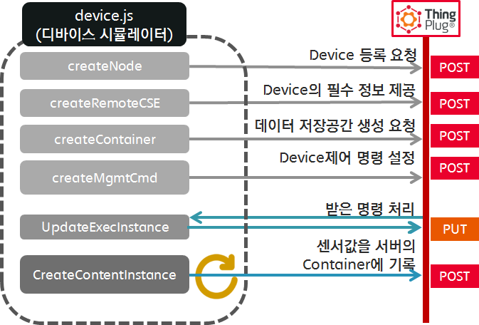

그림 4 - 디바이스 시뮬레이터의 역할

-   실제 센서 값을 ThingPlug에 보내고, Application에서 해당 값을 받기 위해서는 contentInstance의 parameter인 <con> 값을 수정해주어야 합니다. <br> 아래 contents 함수의 return 값이 바로 <con>에 들어가게 됩니다.

```javascript
//////////////config.js////////////////////
module.exports = {
  delimiter : ',',									// contents 구분자															
 
  contents : function(){															// Device에서 ThingPlug로 전달하는 실제 데이터 (contentInstance의 Attribute <con>)
	var value_TEMP = (Math.floor(Math.random() * 5) + this.BASE_TEMP).toString();	// 가상의 온도값
	var value_HUMID = (Math.floor(Math.random() * 5) + this.BASE_HUMID).toString();	// 가상의 습도값
	var value_LUX = (Math.floor(Math.random() * 5) + this.BASE_LUX).toString();		// 가상의 조도값

	return value_TEMP + this.delimiter + value_HUMID + this.delimiter + value_LUX;
  }
};
```  

-   아래 예제는 application에서 ThingPlug에 올라온 가상 센서값을 지정한 delimiter를 이용해 파싱하여 사용하는 부분의 예제입니다.
```javascript
//////////////public/js/app.js////////////////////
//-------------------------------------주기적으로 조회된 최신 데이터 처리---------------------------------------//
	
	getConfig( function(err,config) {

	...
		
	setInterval(function(){
		
		getData(container_name, function(err,time,data_prim){
			var valueTemp = data_prim.split(delimiter[nodeIndex])[0];		// delimiter를 이용하여 온도값 파싱
			var valueHumid = data_prim.split(delimiter[nodeIndex])[1];		// delimiter를 이용하여 습도값 파싱
			var valueLux = data_prim.split(delimiter[nodeIndex])[2];		// delimiter를 이용하여 조도값 파싱
	
	...
	
```  

#### `Device 실행 결과`

다음과 같은 결과 화면이 나오면 정상입니다.

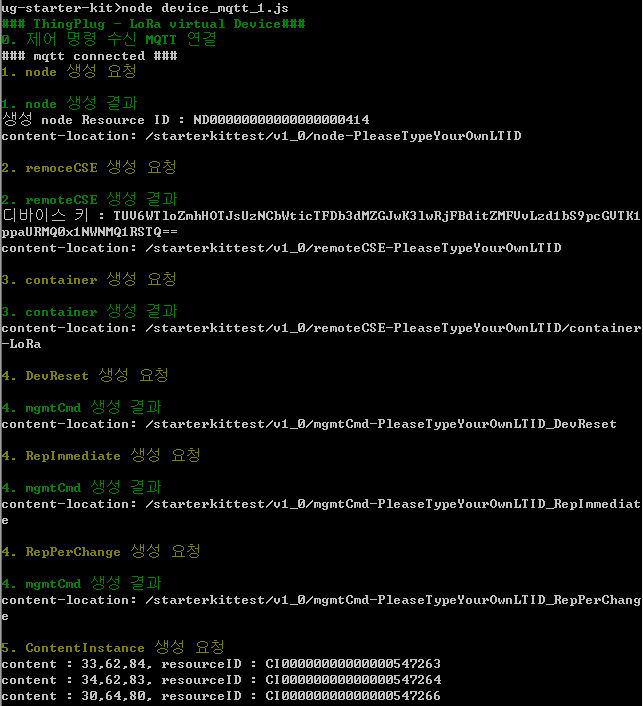

그림 5 – device\_mqtt실행 결과

### <span id="device가-하는-일" class="anchor"><span id="thingplug에-내-계정에-device를-등록" class="anchor"><span id="_Toc459022500" class="anchor"></span></span></span>ThingPlug 내 계정에 Device를 등록

#### 회원가입

아래와 같이 하나의 A 서비스 아래 B,C 단말이 등록된 경우, D서비스가 접근하지 못하게 해야 합니다. 이때 사용되는 Key가 uKey이며, 회원가입을 통해 발급 발을 수 있습니다.

-   **uKey 발급**

    -   외부에서 ThingPlug Rest API 접근 시 정상적인 접근 여부를 판단하는 Access Token Key

(Mqtt Client의 User Credential으로 사용

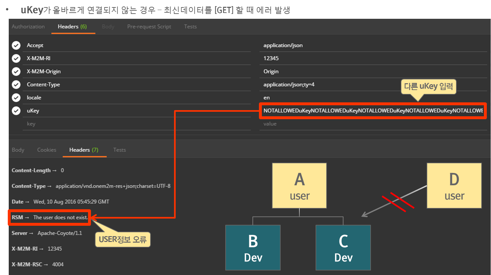

1.  회원가입: https://thingplugdev.sktiot.com

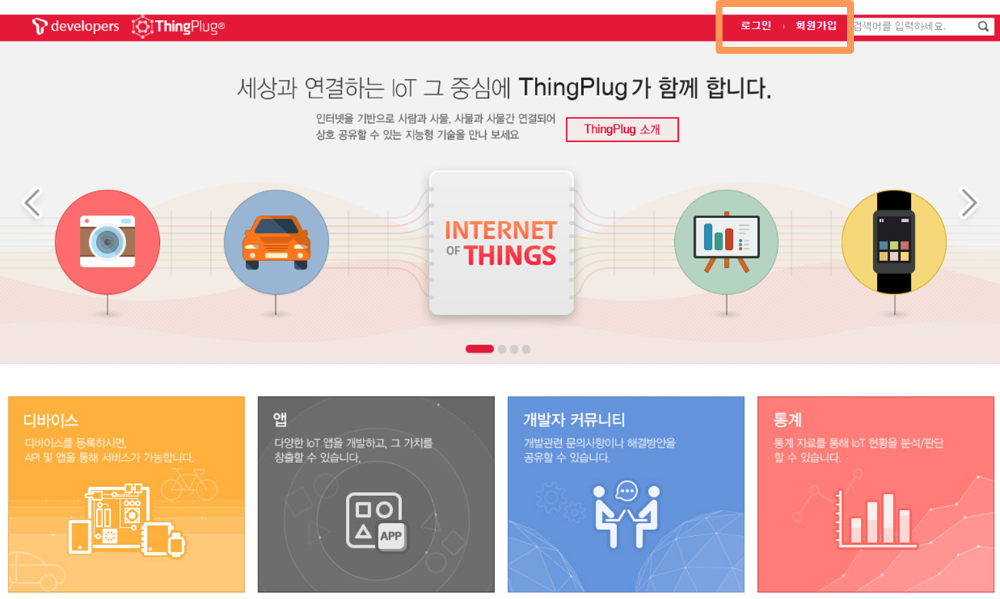

2.  **디바이스 연동 프로토콜: HTTP 선택**

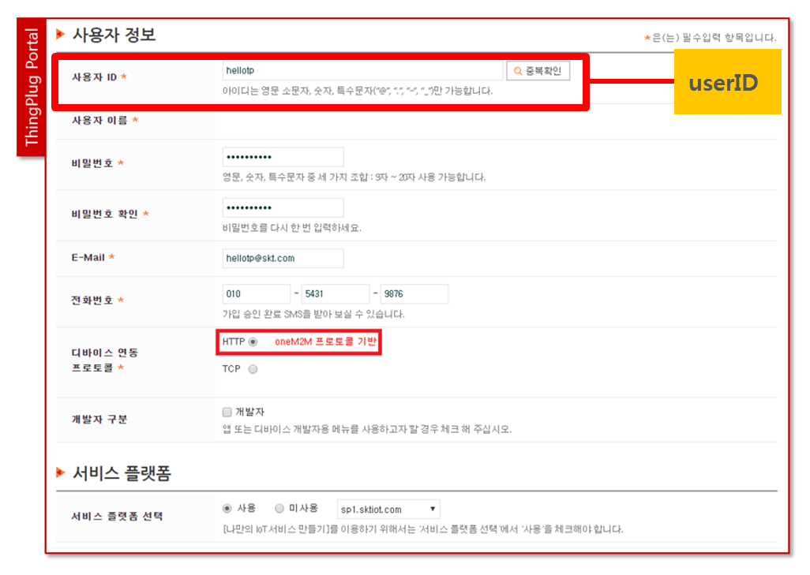

3.  **사용자 인증키: uKey (시스템 생성)**

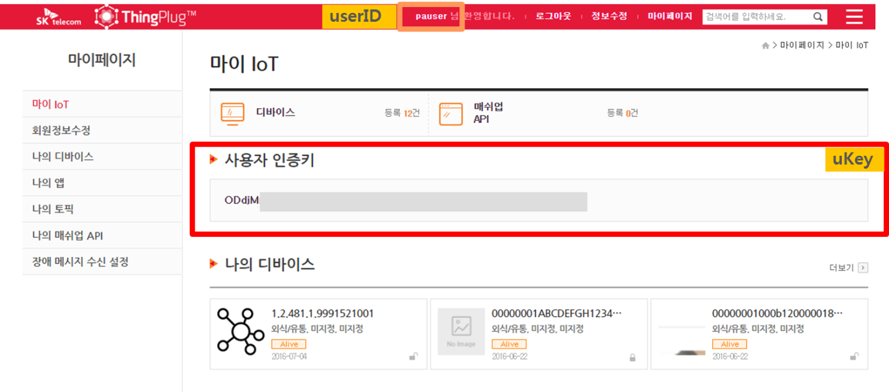

#### 디바이스 등록

애플리케이션에서 ThingPlug oneM2M REST API를 통해 데이터를 필요에 따라 제어명령을 보내기 위해서는 먼저 ThingPlug 사이트에 위 device(생성된 remoteCSE)를 등록해야합니다.

-   단말등록 이전에 단말이 ThingPlug 포탈에 node, remoteCSE 자원이 정상적으로 동록 완료

-   단말 식별 방법은 단말ID(nodeID)와 passCode로 구분

    -   **passCode**

        -   포탈에서 단말을 식별하기위한 사용자지정 단말 비밀번호(4 – 16자리)

        -   단말 등록 과정에서 사용

1.  \[ThingPlug\] 로그인 후 "마이페이지 &gt; 나의 디바이스 &gt; 디바이스 등록" 페이지로 이동

	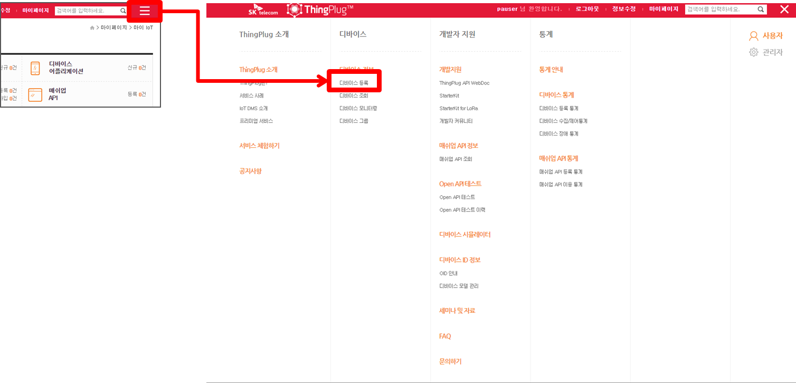

2.  위에서 device 실행 시 사용한 `config.js`의 디바이스 아이디(LTID)와 passCode를 개별등록에 입력하고 `디바이스 정보확인` 버튼

	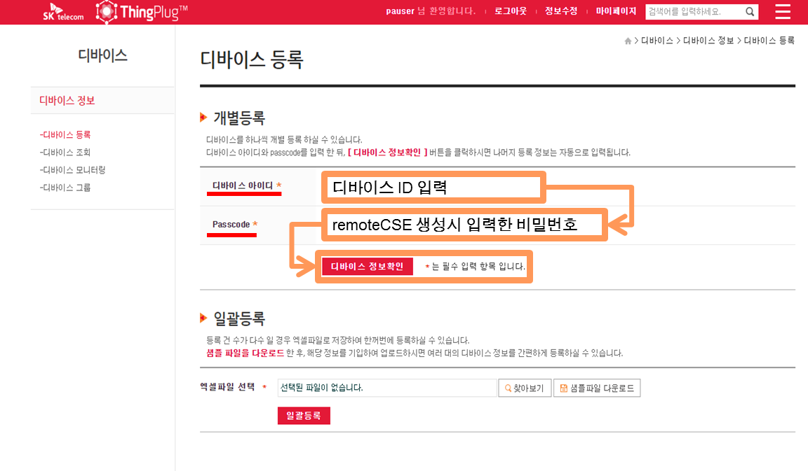

3.  필수정보 입력화면에 내용을 해당 내용을 넣어준 후 하단 '저장'버튼

4.  ThingPlug에 Device 등록 완료

	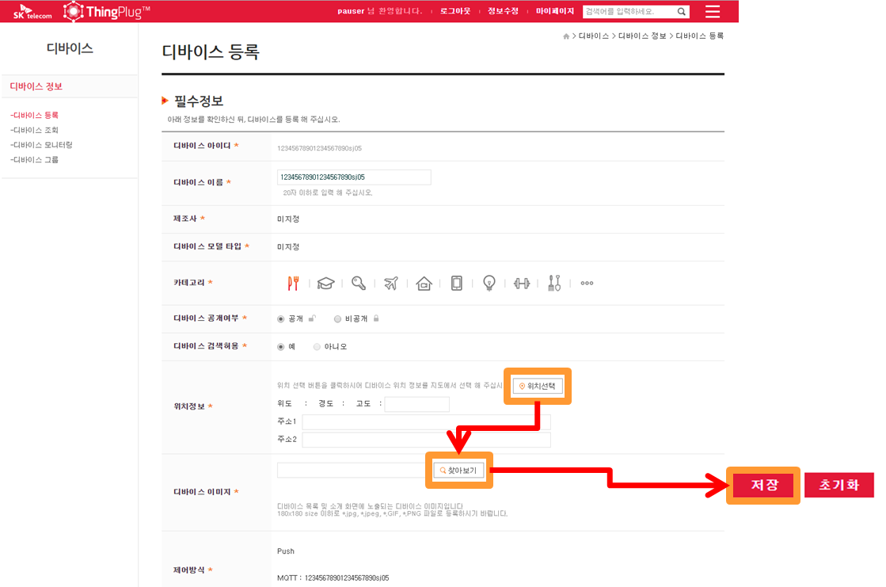

5.  마이페이지 – 나의 디바이스에서 디바이스 등록이 되었음을 확인

	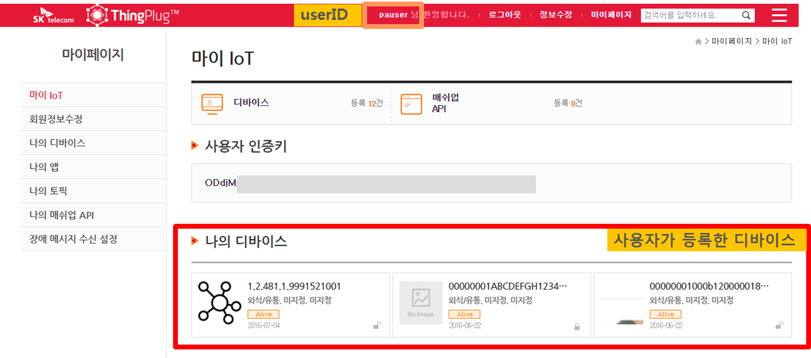

### <span id="application-실행" class="anchor"><span id="_Toc459022501" class="anchor"></span></span>Application 실행

`node application_web.js` 명령어로 application을 실행합니다. (Application 실행하기 전에 `device.js`가 동작하는 상태로 유지합니다. 따라서 `device.js` 실행을 종료하지 않고 새로운 terminal(커맨드창)을 열어 실행하세요. 

웹페이지를 확인하시기 위해서는 `http://[SERVER_IP]:3000/dashboard`를 확인해주세요

해당 web page에서는 device의 위치값을 표시할 수 있고, 디바이스에서 보내온 가상 센서 3종의 값을 보여주며, device에 predefined된 mgmtCmd를 실행할 수 있고, trigger를 설정해 event 발생시 E-MAIL 등으로 알림을 전송 할 수 있습니다.

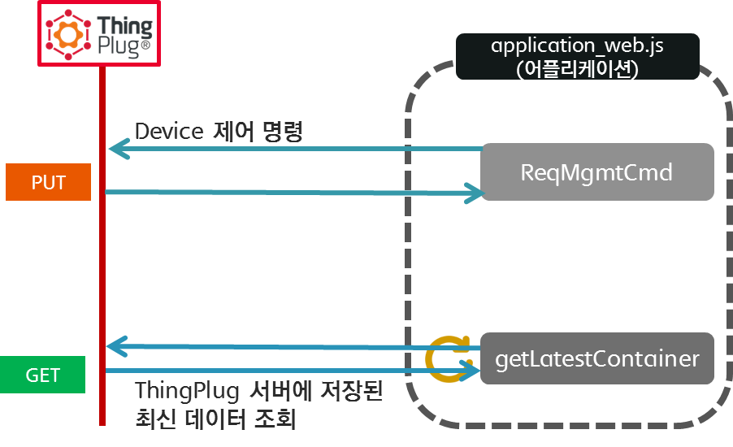

그림 7 – Application 역할

#### Application 하는 일

| 구분                         | 설명                                                       | Method         |
|------------------------------|------------------------------------------------------------|----------------|
| 1. Content Instance 조회     | 가장 최근의 content Instance를 조회합니다.                 | HTTP GET       |
| 2. mgmtCmd 요청              | Device로 보낼 제어 명령을 ThingPlug에게 보냅니다.          | HTTP POST      |
| 3. mgmtCmd execInstance 조회 | Device로 보낸 제어 명령의 상태를 조회 합니다.              | HTTP GET       |
| 4. Sensor Display            | Sensor값(현재 온도, 습도, 조도) 그래프형태로 표시          | d3 API         |
| 5. Google 지도 API           | Device 가상 위치 표시                                      | Google API     |
| 6. Trigger 설정              | Trigger 발생시 notification                                | nodemailer API |
|                              |                                                            |                |

#### Application에서의 제어 요청

실행 후 Application에서 제어를 요청하고, `device.js`가 실행중인 터미널을 살펴보면 ㅁpplication이 보낸 mgmtCmd에 대한 아래와 같은 로그가 보일 것입니다.

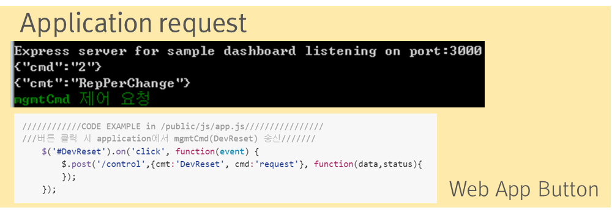

그림 7-1 – Web App에서 버튼 이용한mgmtCmd 요청

Application\_web 코드 예제

```javascript
////////////CODE EXAMPLE in /public/js/app.js////////////////
///버튼 클릭 시 application에서 mgmtCmd(DevReset) 송신///////
	$('#mgmtCmd').on('click', function(event) {
		var reqcmd = document.getElementById('command_value').value;
		$.post('/control', {cmt:mgmtPrefix[nodeIndex],cmd: reqcmd}, function(data,status){
			toastr.info('Your own mgmtCmd : "' + reqcmd + '"');
		});
	});
```

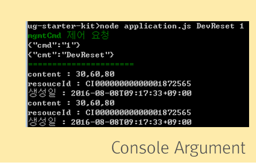

그림 7-2 –CLI에서 Argument를 이용한 mgmtCmd 요청

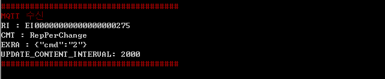

그림 8 – device.js에서 mgmtCmd Push message를 받은 경우 console로그

*///////CODE EXAMPLE in device.js///////////*

1. device\_http.js 예제

```javascript

////////////response for HTTP//////////////
httpRes.createServer(function (req, res) {
...//받은 요청 처리 및 응답
}).listen(ResponsePORT);

```

2. device\_mqtt.js 예제

```javascript

////////////response for MQTT//////////////
client.on('message', function(topic, message){
	var msgs = message.toString().split(',');
	xml2js.parseString( msgs[0], function(err, xmlObj){
		...//받은 요청 처리 및 응답
		
		/////////condition branch device.js//////////////////
		if(...)
			
		}
	});


```

#### Trigger 등록 

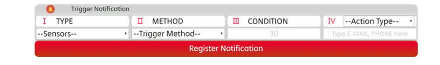

센서값 관련 특정 이벤트 발생시 메일로 알림을 받을 수 있도록 하는 기능입니다.

<a href="https://nodemailer.com/">nodemailer</a> 라이브러리를 활용하였으며, 알림 받고자 하는 메일 주소 및 smtp주소를 이용해 이벤트 발생시 메일로 디바이스의 정보를 받아보세요.

#### <span id="application-하는-일" class="anchor"><span id="web-application-실행" class="anchor"></span></span>Web Application 실행

`node application_web.js` 명령어로 Express.js 서버를 실행합니다. 이제 웹 브라우저를 열어서 실행 중인 서버의 IP로 접속하여 Dashboard를 실행합니다. 가상 센서를 위한 Dashboard는 http://\[SERVER\_IP\]:3000/dashboard 이며, 가상 센서값을 Dashboard에 표시하기 위해서는 `node device.js` 를 실행하면 됩니다. 해당 application의 실제 동작과 관련된 내용을 수정하기 위해서는 `/public/index.html` 파일에서 웹페이지를 수정하고, `/public/js/app.js`파일에서 실제 동작과 관련된 내용을 수정합니다.

> 

<span id="환영합니다.-당신은-이제-thingplug-iot-user입니다" class="anchor"><span id="faq" class="anchor"></span></span>그림 9 – StarterKit Web App 실행 결과

FAQ
---

#### 환영합니다. 당신은 이제 ThingPlug IoT User입니다.
벌써 Starter Kit을 이용하여 SKT ThingPlug 사용에 필요한 구성요소를 준비 완료했습니다. 이제 Application과 Device의 코드를 시작점으로 원하는 서비스를 만들어보세요. 서비스를 개발해 나가는 과정에서 생겨나는 궁금증은 [ThingPlug 개발자 커뮤니티](https://sandbox.sktiot.com/IoTPortal/cmmnty/cmmntyList)를 이용해주세요.

#### Starter Kit에 대한 상세한 내용은 ThingPlug 가이드북을 참고하세요.
[ThingPlug로 시작하는 IoT 서비스 개발](http://book.naver.com/bookdb/book_detail.nhn?bid=9766474)를 참고하세요.

#### device 실행 시 마다 매번 Resource를 등록해야하는 건가요?
아닙니다. 디바이스마다 최초 1회만 Resource를 등록하면 됩니다. 본 스타터킷에서는 디바이스 실행 시 매번 Resource를 등록하도록 되어 있습니다. 이 경우에도 문제가 되는 것은 아닙니다. 다만 같은 ID로 만드려고 하는 경우conflict ( HTTP : 409, MQTT : 4015) 메시지가 발생할것입니다.

#### 마이페이지에 사용자 인증키가 없는데요?
ThingPlug 회원가입 입력양식에 있는 디바이스 연동 프로토콜 선택을 반드시 HTTP로 선택해야 합니다. 그렇지 않을 경우 oneM2M API를 이용할 수 없습니다. 가입시에만 선택이 가능하기 때문에 새로운 아이디로 새 계정을 만들고 가입 입력양식에서 꼭 HTTP로 선택해주세요.

#### MQTT connect가 되지 않습니다
ThingPlug ID와 uKey가 config파일에 제대로 입력이 되었는지 확인해주세요. 그리고 clientId가 다른사람과 겹치는 경우 간혹 문제가 발생할 수 있으니 주의하여 주십시오

#### 센서값이 보이지 않습니다
ThingPlug 포털에 디바이스를 등록하였는지 확인해주세요. 등록하지 않은경우 uKey mapping이 되지 않아 Application에서 디바이스로 접근이 되지 않습니다.

#### config.js가 없다고 나옵니다
Sample코드를 수정했는지, 파일명에서 sample을 지웠는지 다시한번 확인해주세요.
